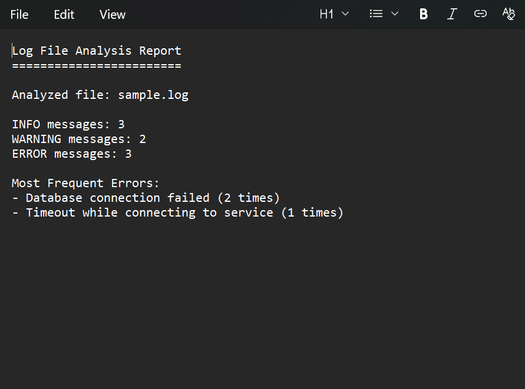

\# Log File Analyzer


\## Overview

A Python-based command-line tool that analyzes application or server log files to identify severity levels and frequent error patterns.


\## Features

\- Accepts any log file as input

\- Categorizes INFO, WARNING, and ERROR logs

\- Identifies most frequent error messages

\- Generates a summary report


\## Technologies Used

\- Python

\- File Handling

\- Regular Expressions


\## How to Run

```bash

python analyzer.py sample.log

## Sample Output




